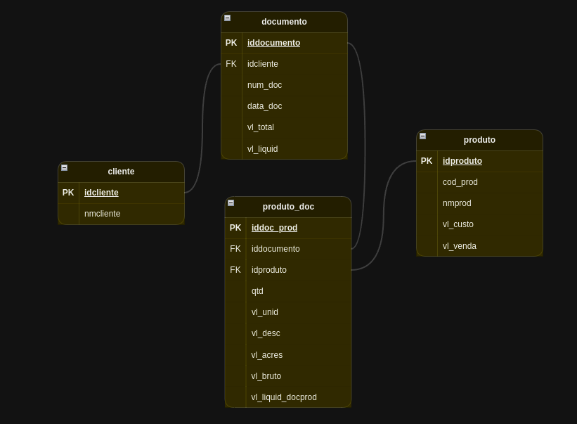

### Aplicação de Comandos DDL, DML e DQL em Exercício de Banco de Dados

Neste exercício de banco de dados, coloquei em prática os conceitos aprendidos no curso ao trabalhar com comandos DDL, DML e DQL. O objetivo foi aplicar essas habilidades para criar e manipular estruturas e dados.

**[DDL (Data Definition Language):](CREATE.sql)**
Criei a estrutura do banco de dados utilizando comandos DDL. Utilizei a instrução `CREATE TABLE` para definir tabelas que representam as entidades.

**[DML (Data Manipulation Language):](INSERT.sql)**
Apliquei comandos DML para manipular os dados. Utilizei a instrução `INSERT INTO` para adicionar registros nas tabelas. Com a instrução `UPDATE`, realizei atualizações específicas nos dados, mantendo a consistência das informações armazenadas.

**[DQL (Data Query Language):](CONSULTAS_ATUALIZACOES.sql)**
Utilizei os comandos DQL para realizar consultas. Utilizando a instrução `SELECT`, extraí informações relevantes das tabelas, aplicando filtros para obter resultados específicos e significativos.

**Modelo de Entidade-Relacionamento (MER):**
Adicionalmente, criei um modelo de Entidade-Relacionamento (MER) básico e simples para representar a estrutura do banco de dados de forma visual. O modelo MER destacou as entidades, seus atributos e os relacionamentos entre elas, proporcionando uma visão clara da organização dos dados.

